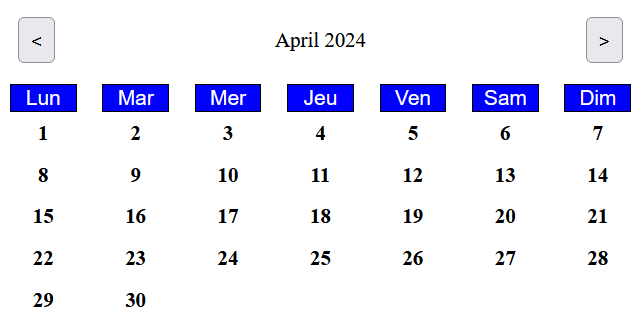
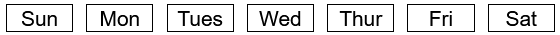
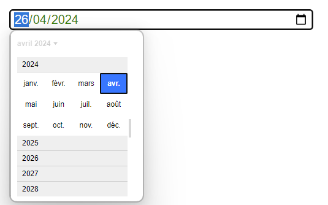
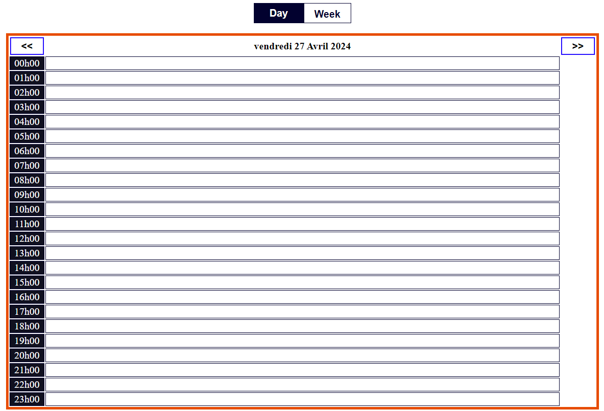
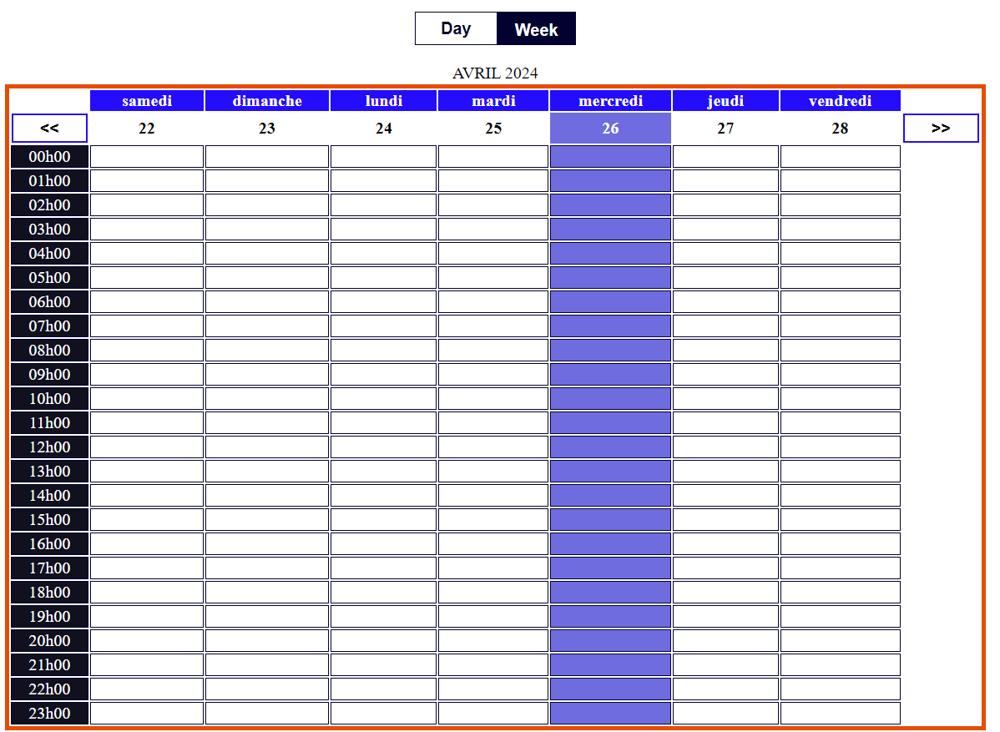

## | Note : La librairie est toujours en cours de développement.

## 📝 Présentation

**Calendar-Style** est une librairie React **flexible** et **personnalisable** qui permet d'intégrer facilement un calendrier dynamique dans vos applications.<br/><br/> Vous avez le contrôle total sur l'apparence et le comportement du calendrier, ce qui vous permet de l'adapter parfaitement à vos besoins spécifiques.<br/><br/> Avec sa structure modulaire et sa documentation complète, l'intégration de "Calendar-Style" dans vos projets est simple et rapide.

## 📚 Sommaire

<br/><br/>
1. [Installation](#installation)
2. [Utilisation](#utilisation)
3. [Composants](#composants)


<br/><br/>

## 📦 Installation <a id="installation"></a>


Installation en exécutant la commande :

```
npm i react-calendar-style
```

<br/><br/>

## 🚀 Utilisation <a id="utilisation"></a>


Exemple d'utilisation des composants:

```js
import { CalendarCases } from "react-calendar-style";

export default function App() {
  return (
    <>
      <CalendarCases
        language="fr"
        color="red"
        fontFamily="Arial"
        backgroundColor="white"
      />
    </>
  );
}
```

<br/>

## ⚒️ Composants <a id="composants"></a>

### CalendarCases

<br/>

Cet élément permet d'afficher un calendrier en mois et jour, qui permet de sélectionner une date, nous retournant des données sous format JSON, afin de pouvoir utiliser l'information si besoin.

| Nom de la propriété | Description                                                | Valeur par défaut        | Exemple           |
| ------------------- | ---------------------------------------------------------- | ------------------------ | ----------------- |
| language            | indique si la langue utilisée est l'anglais ou le français | `fr`                     | `"fr"` ou `"eng"` |
| color               | contrôle la couleur du texte                               | couleur thème par défaut | `"black"`         |
| backgroundColor     | contrôle la couleur du fond                                | couleur thème par défaut | `"white"`         |
| fontFamily          | contrôle la police utilisée                                | police thème par défaut  | `"Arial"`         |
| theme               | contrôle le thème                                          | `Default`                | `"Default"`       |

<br/><br/>


<br/><br/>

### Code:

```js
import { CalendarCases } from "react-calendar-style";

export default function App() {
  return (
    <>
      <CalendarCases
        language="fr"
        color="red"
        fontFamily="Arial"
        backgroundColor="white"
      />
    </>
  );
}
```

<br/><br/>

### WeekDaysCases

<br/>

Cet élément permet d'afficher les jours de la semaine en français ou en anglais en tenant compte du type de calendrier.
<br/><br/>

| Nom de la propriété | Description                                                | Valeur par défaut        | Exemple     |
| ------------------- | ---------------------------------------------------------- | ------------------------ | ----------- |
| english             | indique si la langue utilisée est l'anglais ou le français | `false`                  | `true`      |
| color               | contrôle la couleur                                        | couleur thème par défaut | `"black"`   |
| backgroundColor     | contrôle la couleur du fond                                | couleur thème par défaut | `"white"`   |
| fontFamily          | contrôle la police utilisée                                | police thème par défaut  | `"Arial"`   |
| theme               | contrôle le thème                                          | `Default`                | `"Default"` |

<br/><br/>

<br/><br/>

### Code:

```js
import { WeekDaysCases } from "react-calendar-style";

export default function App() {
  return (
    <div className="app">
      <WeekDaysCases />
    </div>
  );
}
```

### InputDate

<br/>

Cet élément permet de créer un champ où l’utilisateur peut saisir une date.
<br/>
Il permet à l’utilisateur de sélectionner facilement une date via un sélecteur de date: Il peut faire une recherche rapide pour acceder aux differents mois et années

<br/><br/>

| Nom de la propriété | Description                                                              | Valeur par défaut        | Exemple      |
| ------------------- | ------------------------------------------------------------------------ | ------------------------ | ------------ |
| language            | indique si la langue utilisée est l'anglais ("eng") ou le français ("fr) | `fr`                     | `"eng"`      |
| color               | contrôle la couleur                                                      | couleur thème par défaut | `"black"`    |
| backgroundColor     | contrôle la couleur du fond                                              | couleur thème par défaut | `"white"`    |
| fontFamily          | contrôle la police utilisée                                              | police thème par défaut  | `"Arial"`    |
| theme               | contrôle le thème                                                        | `Default`                | `"Default"`  |
| height              | contrôle la hauteur                                                      | couleur thème par défaut | `""200px""`  |
| widht               | contrôle la largeur                                                      | largeur thème par défaut | `""200px"`   |
| border              | contrôle la bordure                                                      | bordure thème par défaut | `"1 px S B"` |
| border-Radius       | contrôle de l'inclinaison de la bordure                                  | `Default`                | `"5px"`      |

<br/><br/>



<br/><br/>

### Code:

```js
import { useState } from "react";
import { InputDate } from "react-calendar-style";

export default function App() {
  const currentDate = new Date();
  const [date, setDate] = useState(currentDate);

  return (
    <div className="app">
      <InputDate
        value={date}
        setValue={setDate}
        height="40px"
        width="30%"
        background="white"
        color="green"
        fontFamily="Arial"
        border="3px solid grey"
        borderRadius="5px"
      />
    </div>
  );
}
```

<br/><br/>

### SaisonImg

<br/>
Cet élément permet d'afficher plusieurs images de manière alternée en fonction des saisons.
L'utilisateur a le choix de garder les images déjà prédéfinies ou de choisir ses propres images en important le dossier image dans son composant.

| Nom de la propriété | Description                             | Valeur par défaut        | Exemple      |
| ------------------- | --------------------------------------- | ------------------------ | ------------ |
| height              | contrôle la hauteur                     | couleur thème par défaut | `"400px"`    |
| widht               | contrôle la largeur                     | largeur thème par défaut | `"400px`     |
| border              | contrôle la bordure                     | bordure thème par défaut | `"1 px S B"` |
| border-Radius       | contrôle de l'inclinaison de la bordure | `Default`                | `"5px"`      |
| theme               | contrôle le thème                       | `Default`                | `"Default"`  |
| date                | contrôle de l'image selon les dates     | dates selon les saisons  | `"Hiver"`    |

<br/><br/>


<br/><br/>

### Code:

```js
import { useState } from "react";
import { InputDate, SaisonImg } from "react-calendar-style";

export default function App() {
  const currentDate = new Date();
  const [date, setDate] = useState(currentDate);

  return (
    <div className="app">
    {/*utiliser InputDate pour la modification d'image */}
      <InputDate value={date} setValue={setDate} /> 
      <SaisonImg
        date={`${date.getFullYear()}-${date.getMonth() + 1}-${date.getDate()}`}
        width="30%"
      />
    </div>
  );
}
```

<br/><br/>

### GridDay

<br/>

Cet élément permet d'afficher une journée de la semaine et d'avoir toutes les heures de la journée selectionnée
L'utilisateur a le choix passer d'une journee a une autre en faisant appel au composant Btn.

<br/>

| Nom de la propriété | Description                        | Valeur par défaut        | Exemple      |
| ------------------- | ---------------------------------- | ------------------------ | ------------ |
| height              | contrôle la hauteur                | couleur thème par défaut | `"400px"`    |
| padding             | contrôle la l'espacement interieur | padding thème par défaut | `"5px 20px"` |
| value               | contrôle la date                   | current date             | current date |
| setValue            | contrôle de la date appellee       | get day                  | day selected |

<br/>


<br/>

### Code:

```js
import { GrilleDay } from "react-calendar-style";

function App() {
  return (
    <div className="app">
      <GrilleDay />
    </div>
  );
}
```

### GrilleWeek

<br/>

Cet élément permet d'afficher les jours de la semaine et toutes les heures.
L'utilisateur a le choix passer d'une semaine a une autre en faisant appel au composant Btn.

<br/><br/>



<br/>

| Nom de la propriété | Description                        | Valeur par défaut        | Exemple      |
| ------------------- | ---------------------------------- | ------------------------ | ------------ |
| height              | contrôle la hauteur                | couleur thème par défaut | `"400px"`    |
| padding             | contrôle la l'espacement interieur | padding thème par défaut | `"5px 20px"` |
| value               | contrôle la date                   | current date             | current date |
| setValue            | contrôle de la date appellee       | get day                  | day selected |

<br/><br/>

### Code:

```js
import { GrilleWeek } from "react-calendar-style";

function App() {
  return (
    <div className="app">
      <GrilleWeek />
    </div>
  );
}
```

### Grille

<br/>

Cet élément permet de faire un switch avec le toggle(boutton Day et Week) entre les jours de la semaine et toutes les heures, ainsi que les une une journee avec les heures.
ce composant regroupe plusieurs composnat pour son bon fonctionnement: GridDay, GridWeek et Btn.

<br/>

| Nom de la propriété | Description                  | Valeur par défaut        | Exemple      |
| ------------------- | ---------------------------- | ------------------------ | ------------ |
| height              | contrôle la hauteur          | couleur thème par défaut | `"400px"`    |
| value               | contrôle la date             | current date             | current date |
| setValue            | contrôle de la date appellee | get day                  | day selected |

<br/>


<br/>

### Code:

```js
import { Grille } from "react-calendar-style";

function App() {
  return (
    <div className="app">
      <Grille />
    </div>
  );
}
```
