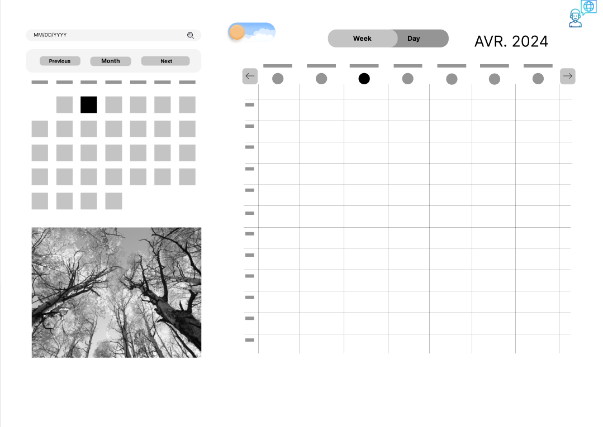

##  |  Note : La librairie est toujours en cours de développement.



## 📝 Présentation

**Calendar-Style** est une librairie React **flexible** et **personnalisable** qui permet d'intégrer facilement un calendrier dynamique dans vos applications.<br/><br/> Vous avez le contrôle total sur l'apparence et le comportement du calendrier, ce qui vous permet de l'adapter parfaitement à vos besoins spécifiques.<br/><br/> Avec sa structure modulaire et sa documentation complète, l'intégration de "Calendar-Style" dans vos projets est simple et rapide.

## 📚 Sommaire

- Installation
- Utilisation
- Composants :
  - Description 
  - Capture image
  - Props
  - Code

<br/><br/>
## 📦 Installation

Installation en exécutant la commande

```
git clone git@github.com:WildCodeSchool-CDA-LYON-02-2024/P2-react-calendar-style.git
```
<br/><br/>
## 🚀 Utilisation

Exemple d'utilisation des composants:

```
import CalendarCases from './components/calendarCases/CalendarCases';

function App() {
    return (
    <>
      <CalendarCases
        language='fr'
        color='red'
        fontFamily='Roboto'
        backgroundColor='white'
      />
    </>
    );
}
```

<br/>

## ⚒️ Props

### CalendarCases

<br/>

Cet élément permet d'afficher un calendrier en mois et jour.
<br/><br/>

| Nom de la propriété | Description | Valeur par défaut | Exemple |
| ------------------- | ----------- | ----------------- | ------- |
| language            | Title       | Header            | Title   |
| color               | Text        | Header            | Title   |
| backgroundColor     | Text        | Header            | Title   |
| fontFamily          | Text        | Header            | Title   |
<br/><br/>

### WeekDaysCases

<br/>

Cet élément permet d'afficher les jours de la semaine en français ou en anglais en tenant compte du type de calendrier.
<br/><br/>

| Nom de la propriété | Description | Valeur par défaut | Exemple |
| ------------------- | ----------- | ----------------- | ------- |
| english             | indique si la langue utilisée est l'anglais ou le français       | `false`            | `true`   |
| color               | contrôle la couleur        | couleur thème par défaut            |`"black"`   |
| backgroundColor     | contrôle la couleur du fond       | couleur thème par défaut            | `white`   |
| fontFamily          | contrôle la police utilisée        | police thème par défaut            | `Arial`   |
| theme               | contrôle le thème       | `Default`           | `Default`   |
<br/><br/>

### InputDate 
<br/>

Cet élément permet de créer un champ où l’utilisateur peut saisir une date.
<br/>
Il permet à l’utilisateur de sélectionner facilement une date via  un sélecteur de date.
<br/><br/>

| Nom de la propriété | Description | Valeur par défaut | Exemple |
| ------------------- | ----------- | ----------------- | ------- |
| language            | indique si la langue utilisée est l'anglais ("eng") ou le français ("fr)      | `fr`            | `eng`   |
| color               | contrôle la couleur        | couleur thème par défaut            |`"black"`   |
| backgroundColor     | contrôle la couleur du fond        | couleur thème par défaut            | `white`   |
| fontFamily          | contrôle la police utilisée        | police thème par défaut            | `Arial`   |
| theme               | contrôle le thème        | `Default`           | `Default`  |
<br/><br/>
### SaisonImg
<br/>
Cet élément permet d'afficher plusieurs images de manière alternée en fonction des saisons.

| Nom de la propriété | Description | Valeur par défaut | Exemple |
| ------------------- | ----------- | ----------------- | ------- |
| language            | Title       | Header            | Title   |
| color               | Text        | Header            | Title   |
| backgroundColor     | Text        | Header            | Title   |
| fontFamily          | Text        | Header            | Title   |
| theme               | Text        | Header            | Title   |
